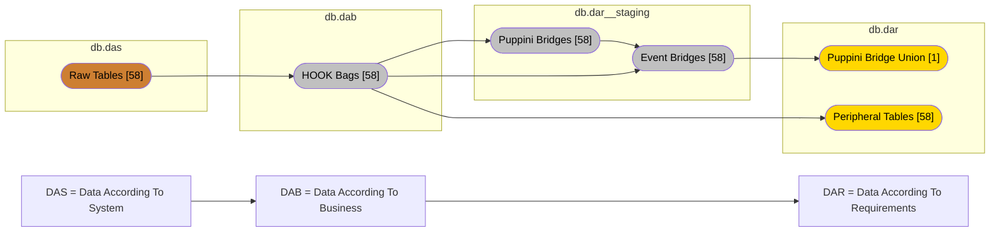

# Serverless Lakehouse
    

This project utilizes dlt, DuckDB, and SQLMesh, to create a serverless lakehouse by:
1. Extracting data from source via dlt.
2. Loading the data to iceberg tables.
3. Reading DAS using DuckDB.
4. Transforming the data using SQLMesh.
5. Extracting DAB & DAR from DuckDB with dlt.
6. Loading DAB & DAR to iceberg tables.

It does this locally into `./lakehouse`, which could be replaced by a S3 bucket.

## Streamlit Dashboard

## Design Overview
The lakehouse follows the design pattern called ["Analytical Data Storage System", by Patrik Lager](https://www.linkedin.com/pulse/analytical-data-storage-system-fundamental-design-principles-lager-ojt0f), that consists of three layers:
1. DAS - Data According To System (Unaltered data)
1. DAB - Data According To Business (Transformed to fit with how the business sees the data)
1. DAR - Data According To Requirements (Transformed into a model that BI tools can use)

The reason for this is that I find it much clearer than the medallion architecture.

For `DAB` I choose the [HOOK method, by Andrew Foad](https://hookcookbook.substack.com/). A simple explanation is that you define hooks for each table, and each hook is tied to a core business concept (CBC), e.g., sales order.

For `DAR` I choose the [Unified Star Schema, by Fransesco Puppini](https://www.amazon.com/Unified-Star-Schema-Resilient-Warehouse/dp/163462887X). It's a star schema without facts and dimensions. Instead there is a bridge that holds all the relations and then the peripheral table, which can be used & seen as being both fact & dimension at the same time.

Both of these modelling techniques are both simple and fast to create, and can be rebuilt anytime you want. They could even be views on top of `DAS`.
In my case, I wrote a yaml containing the CBCs and what hooks are in each bag. I then used python scripts to generate all the model definitions (~300).

I've also extended the *Puppini Bridge* with events. So for each bag, there is at least one date field. What this allows me to do is connect each row to a canonical calendar.
From my POV each measure & metric must have a temporal anchor of some sort. E.g., `invoice amount` should be more explicitly defined: `invoice due amount`, `invoice paid amount`.

## Architecture

## Lineage / DAG
*Simplified since there are 200+ models in total.*

The bridges in `db.dar__staging`uses what I call "cascading inheritance", it looks up the foreign pit hook in the primary bridge for that hook, and inherits other foreign pit hooks.

```mermaid
flowchart LR
    classDef bronze fill:#CD7F32,color:black
    classDef silver fill:#C0C0C0,color:black
    classDef gold fill:#FFD700,color:black

    subgraph db.das["db.das"]
        raw__adventure_works__product_categories(["raw__adventure_works__product_categories"]):::bronze
        raw__adventure_works__product_subcategories(["raw__adventure_works__product_subcategories"]):::bronze
        raw__adventure_works__products(["raw__adventure_works__products"]):::bronze
        raw__adventure_works__sales_order_details(["raw__adventure_works__sales_order_details"]):::bronze
    end
    
    subgraph db.dab["db.dab"]
        bag__adventure_works__product_categories(["bag__adventure_works__product_categories"]):::silver
        bag__adventure_works__product_subcategories(["bag__adventure_works__product_subcategories"]):::silver
        bag__adventure_works__products(["bag__adventure_works__products"]):::silver
        bag__adventure_works__sales_order_details(["bag__adventure_works__sales_order_details"]):::silver
    end
    
    subgraph db.dar__staging["db.dar__staging"]
        bridge__product_categories(["bridge__product_categories"]):::silver
        bridge__product_subcategories(["bridge__product_subcategories"]):::silver
        bridge__products(["bridge__products"]):::silver
        bridge__sales_order_details(["bridge__sales_order_details"]):::silver
        
        events__product_categories(["events__product_categories"]):::silver
        events__product_subcategories(["events__product_subcategories"]):::silver
        events__products(["events__products"]):::silver
        events__sales_order_details(["events__sales_order_details"]):::silver
    end

    subgraph db.dar["db.dar"]
        unified_bridge(["_bridge__as_of"]):::gold
    end

    raw__adventure_works__product_categories --> bag__adventure_works__product_categories --> bridge__product_categories --> bridge__product_subcategories --> bridge__products --> bridge__sales_order_details
    raw__adventure_works__product_subcategories --> bag__adventure_works__product_subcategories --> bridge__product_subcategories
    raw__adventure_works__products --> bag__adventure_works__products --> bridge__products
    raw__adventure_works__sales_order_details --> bag__adventure_works__sales_order_details --> bridge__sales_order_details

    bridge__product_categories -----> events__product_categories --> unified_bridge
    bridge__product_subcategories ----> events__product_subcategories --> unified_bridge
    bridge__products ---> events__products --> unified_bridge
    bridge__sales_order_details --> events__sales_order_details --> unified_bridge
```

## ERDs - Oriented Data Models
Under construction
