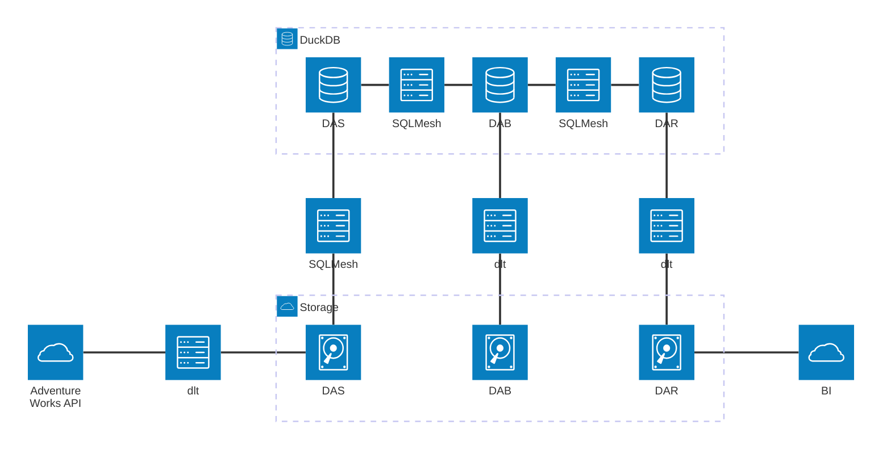

# Serverless Lakehouse
    

## Overview

This project demonstrates a modern, serverless approach to data warehousing that combines the simplicity of local file storage with the power of cloud-native architectures. It implements a three-layer data architecture using innovative modeling techniques that prioritize business alignment and analytical flexibility.

The solution:
1. Extracts data from source systems via dlt
2. Loads raw data to Iceberg tables (DAS layer)
3. Transforms data into a business-aligned model using HOOK methodology (DAB layer)
4. Creates a unified analytical structure using Puppini Bridges (DAR layer)
5. Provides visualization through Streamlit dashboards

All data is stored locally in `./lakehouse` (which could be replaced by a cloud storage bucket in production).

## Streamlit Dashboard

## Architecture Principles

This lakehouse follows the ["Analytical Data Storage System" design pattern by Patrik Lager](https://www.linkedin.com/pulse/analytical-data-storage-system-fundamental-design-principles-lager-ojt0f), consisting of three distinct layers:

1. **DAS - Data According To System**: Raw, unaltered data ingested from source systems with minimal transformation. This layer preserves the original data structure and serves as a foundation for auditing and lineage.

2. **DAB - Data According To Business**: Data transformed and aligned with business concepts using the HOOK methodology. This layer bridges technical implementation with business understanding.

3. **DAR - Data According To Requirements**: Data structured to support specific analytical needs using the Unified Star Schema pattern. This layer optimizes for query performance and dimensional analysis.

This architecture provides greater clarity and simplicity compared to traditional medallion architecture approaches.

## Modeling Approaches

### HOOK Methodology for DAB Layer

The DAB layer implements the [HOOK methodology](https://hookcookbook.substack.com/), which provides a lightweight and flexible approach to data modeling:

- **Core Business Concepts (CBCs)**: Define the fundamental entities that the business cares about
- **Hooks**: Provide integration points aligned with business concepts
- **Frames**: Contain source-aligned data with references to hooks
- **KeySets**: Qualify business keys to prevent collisions between sources

This approach allows source data to remain unchanged while providing clear business alignment through the hook layer. This significantly simplifies data transformation and governance.

### Unified Star Schema for DAR Layer

The DAR layer uses the [Unified Star Schema (USS) by Francesco Puppini](https://www.amazon.com/Unified-Star-Schema-Resilient-Warehouse/dp/163462887X), which offers several advantages:

- Eliminates the traditional fact/dimension divide, allowing each table to serve both analytical roles
- Centers on a bridge table that manages relationships between peripheral tables
- Simplifies query patterns and improves maintenance compared to traditional star schemas

I've extended the Puppini Bridge with event functionality, connecting each row to a canonical calendar and providing explicit temporal anchors for all metrics and measures.

## Technical Architecture

## Data Flow and Lineage

The project contains over 200 models organized in a logical flow from source to consumption. Here's a simplified view of the data lineage:

### Cascading PIT Hook Inheritance

A key innovation in this architecture is the "cascading inheritance" pattern used in bridges. Each bridge inherits PIT (Point-in-Time) hooks from its parent bridges, allowing for consistent temporal alignment throughout the model hierarchy:

```mermaid
flowchart LR
    classDef bronze fill:#CD7F32,color:black
    classDef silver fill:#C0C0C0,color:black
    classDef gold fill:#FFD700,color:black

    subgraph db.das["db.das"]
        raw__adventure_works__product_categories(["raw__adventure_works__product_categories"]):::bronze
        raw__adventure_works__product_subcategories(["raw__adventure_works__product_subcategories"]):::bronze
        raw__adventure_works__products(["raw__adventure_works__products"]):::bronze
        raw__adventure_works__sales_order_details(["raw__adventure_works__sales_order_details"]):::bronze
    end
    
    subgraph db.dab["db.dab"]
        frame__adventure_works__product_categories(["frame__adventure_works__product_categories"]):::silver
        frame__adventure_works__product_subcategories(["frame__adventure_works__product_subcategories"]):::silver
        frame__adventure_works__products(["frame__adventure_works__products"]):::silver
        frame__adventure_works__sales_order_details(["frame__adventure_works__sales_order_details"]):::silver
    end
    
    subgraph db.dar__staging["db.dar__staging"]
        bridge__product_categories(["bridge__product_categories"]):::silver
        bridge__product_subcategories(["bridge__product_subcategories"]):::silver
        bridge__products(["bridge__products"]):::silver
        bridge__sales_order_details(["bridge__sales_order_details"]):::silver
        
        events__product_categories(["events__product_categories"]):::silver
        events__product_subcategories(["events__product_subcategories"]):::silver
        events__products(["events__products"]):::silver
        events__sales_order_details(["events__sales_order_details"]):::silver
    end

    subgraph db.dar["db.dar"]
        unified_bridge(["_bridge__as_of"]):::gold
    end

    raw__adventure_works__product_categories --> frame__adventure_works__product_categories --> bridge__product_categories --> bridge__product_subcategories --> bridge__products --> bridge__sales_order_details
    raw__adventure_works__product_subcategories --> frame__adventure_works__product_subcategories --> bridge__product_subcategories
    raw__adventure_works__products --> frame__adventure_works__products --> bridge__products
    raw__adventure_works__sales_order_details --> frame__adventure_works__sales_order_details --> bridge__sales_order_details

    bridge__product_categories -----> events__product_categories --> unified_bridge
    bridge__product_subcategories ----> events__product_subcategories --> unified_bridge
    bridge__products ---> events__products --> unified_bridge
    bridge__sales_order_details --> events__sales_order_details --> unified_bridge
```

The alternative would have been to connect all the associated frames to the bridge, but that would increase the computational demands since each join requires a `left.valid_from BETWEEN right.valid_from AND right.valid_to`. And the only benefit is that the bridges can be built independently. I prefer lower computational cost in this case.

```mermaid
flowchart LR
    classDef bronze fill:#CD7F32,color:black
    classDef silver fill:#C0C0C0,color:black
    classDef gold fill:#FFD700,color:black

    subgraph db.das["db.das"]
        raw__adventure_works__product_categories(["raw__adventure_works__product_categories"]):::bronze
        raw__adventure_works__product_subcategories(["raw__adventure_works__product_subcategories"]):::bronze
        raw__adventure_works__products(["raw__adventure_works__products"]):::bronze
        raw__adventure_works__sales_order_details(["raw__adventure_works__sales_order_details"]):::bronze
    end
    
    subgraph db.dab["db.dab"]
        frame__adventure_works__product_categories(["frame__adventure_works__product_categories"]):::silver
        frame__adventure_works__product_subcategories(["frame__adventure_works__product_subcategories"]):::silver
        frame__adventure_works__products(["frame__adventure_works__products"]):::silver
        frame__adventure_works__sales_order_details(["frame__adventure_works__sales_order_details"]):::silver
    end
    
    subgraph db.dar__staging["db.dar__staging"]
        bridge__product_categories(["bridge__product_categories"]):::silver
        bridge__product_subcategories(["bridge__product_subcategories"]):::silver
        bridge__products(["bridge__products"]):::silver
        bridge__sales_order_details(["bridge__sales_order_details"]):::silver
        
        events__product_categories(["events__product_categories"]):::silver
        events__product_subcategories(["events__product_subcategories"]):::silver
        events__products(["events__products"]):::silver
        events__sales_order_details(["events__sales_order_details"]):::silver
    end

    subgraph db.dar["db.dar"]
        unified_bridge(["_bridge__as_of"]):::gold
    end

       raw__adventure_works__product_categories --> frame__adventure_works__product_categories --> bridge__product_categories
    frame__adventure_works__product_categories --> bridge__product_subcategories
    frame__adventure_works__product_categories --> bridge__products
    frame__adventure_works__product_categories --> bridge__sales_order_details
 
    raw__adventure_works__product_subcategories --> frame__adventure_works__product_subcategories --> bridge__product_subcategories
    frame__adventure_works__product_subcategories --> bridge__products
    frame__adventure_works__product_subcategories --> bridge__sales_order_details
    
    raw__adventure_works__products --> frame__adventure_works__products --> bridge__products
    frame__adventure_works__products --> bridge__sales_order_details    
    
    raw__adventure_works__sales_order_details --> frame__adventure_works__sales_order_details --> bridge__sales_order_details
    bridge__product_categories --> events__product_categories --> unified_bridge
    bridge__product_subcategories --> events__product_subcategories --> unified_bridge
    bridge__products --> events__products --> unified_bridge
    bridge__sales_order_details --> events__sales_order_details --> unified_bridge
```

## Implementation Approach

The entire model structure is generated programmatically using Python scripts that interpret YAML configuration files. This approach provides several advantages:

1. **Consistency**: All models follow consistent naming and structural patterns
2. **Maintainability**: Changes to modeling approach can be applied across all models simultaneously
3. **Extensibility**: New source systems can be integrated by simply updating the configuration
4. **Documentation**: Model relationships and dependencies are explicitly defined and easily visualized

## How To
1. Clone the project
2. Run `uv run task init` the first time. When done, the streamlit app will launch.
3. Following that, use `uv run task elt` instead. The main difference between them is that the first runs `sqlmesh plan prod` and the other `sqlmesh run prod`.
