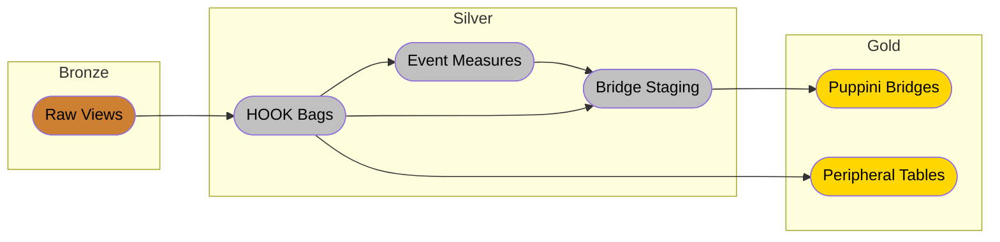

# Serverless Lakehouse

This project utilizes dlt, DuckDB, and SQLMesh, to create a serverless lakehouse by:
1. Extracting data from source via dlt.
2. Loading the data to delta files.
3. Reading the bronze using DuckDB.
4. Transforming the data using SQLMesh.
5. Extracting silver & gold from DuckDB with dlt.
6. Loading silver & gold to delta files.

It does this locally into `./lakehouse`, which could be replaced by a S3 bucket.

## Streamlit Dashboard

## Architecture

## Lineage / DAG
*Simplified since there are 200+ models in total.*

## ERDs - Oriented Data Models
### Bronze

### Silver
Under construction

### Gold

